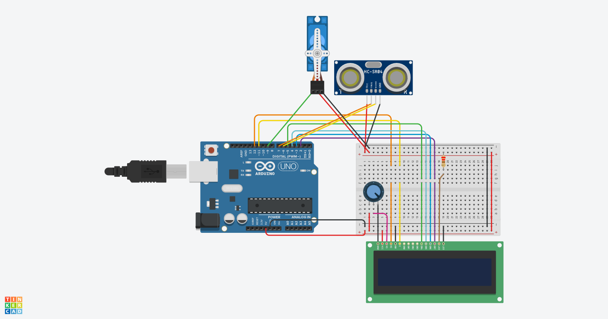

# Arduino-Servo-Radar

Project that uses an Arduino UNO, an ultrasonic sensor, and a servo motor to create a rotating radar. This repository contains the code for a standalone LCD version which displays a strength bar and object distance on a 16x2 LCD screen (on the radar.cc file) and a PC GUI version which visualizes the radar sweep with Python and Pygame interface (on the main.py file).

### Project Demo

### Wiring Schematic

