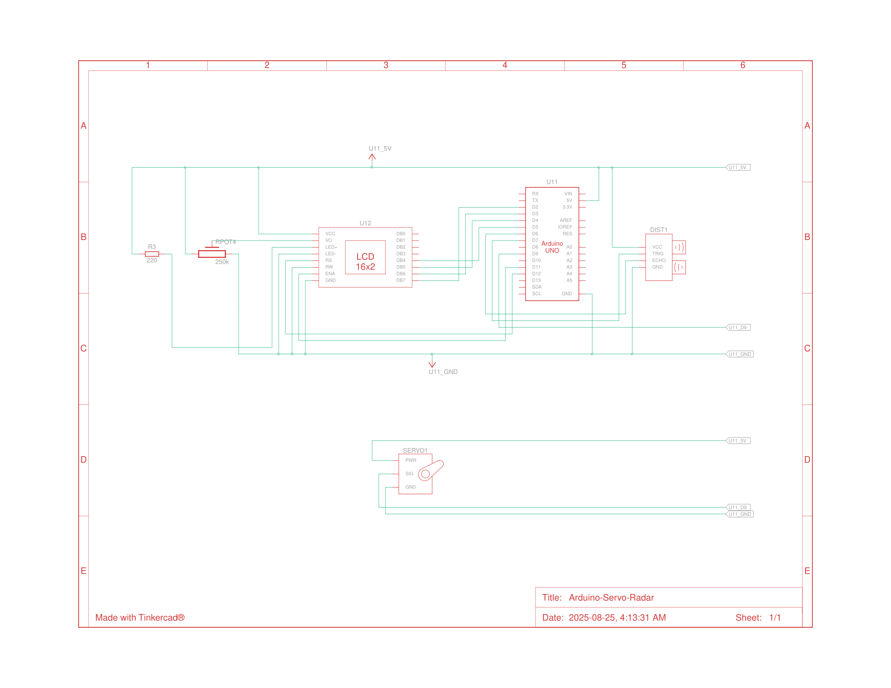

# Arduino Servo Radar

This project utilizes an Arduino UNO, an ultrasonic sensor, and a servo motor to create a functional radar system. It includes two versions: a standalone version that displays object distance on a 16x2 LCD screen, and a PC version that provides a graphical user interface (GUI) to visualize the radar sweep using Python and Pygame.

## Project Demo


## Features

*   **180-Degree Scanning:** The servo motor sweeps the ultrasonic sensor across a 180-degree field of view.
*   **Object Detection:** The HC-SR04 ultrasonic sensor detects objects within its range.
*   **Dual Display Options:**
    *   **Standalone LCD:** Displays the real-time distance to a detected object on a 16x2 LCD.
    *   **PC GUI:** A Python and Pygame-based graphical interface visualizes the radar sweep and detected objects on your computer.

## Hardware Components

*   Arduino UNO
*   Servo Motor (e.g., SG90)
*   Ultrasonic Sensor (HC-SR04)
*   16x2 LCD Display
*   Potentiometer (10kΩ for LCD contrast)
*   Jumper Wires
*   Breadboard

## Software Requirements

*   Arduino IDE
*   Python 3
*   **Python Libraries:**
    *   `pygame`: Install using `pip install pygame`
    *   `pyserial`: Install using `pip install pyserial`

## Wiring Schematic



## Installation and Setup

1.  **Hardware:** Assemble the components on a breadboard according to the wiring schematic provided.
2.  **Arduino:**
    *   Connect the Arduino UNO to your computer.
    *   Open the `radar.ino` file in the Arduino IDE.
    *   Go to `Tools > Board` and select "Arduino Uno".
    *   Go to `Tools > Port` and select the correct COM port for your Arduino.
    *   Click the "Upload" button to flash the sketch to the Arduino.
3.  **Python GUI:**
    *   Ensure you have installed the required Python libraries (`pygame` and `pyserial`).
    *   Open the `main.py` file in a text editor or IDE.
    *   **Crucial Step:** Locate the line `portName = 'COM3'` and change `'COM3'` to the COM port your Arduino is connected to (mainly for Windows users).
    *   Save the `main.py` file.

## How to Use

*   **Standalone LCD Version:** Once the Arduino is programmed and powered on, the radar will begin scanning automatically. The LCD will display the distance of any detected objects in its path.
*   **PC GUI Version:** With the Arduino connected to your PC and the sketch uploaded, run the `main.py` script from your terminal:
    ```sh
    python main.py
    ```
    A Pygame window will launch, displaying the radar visualization in real-time.